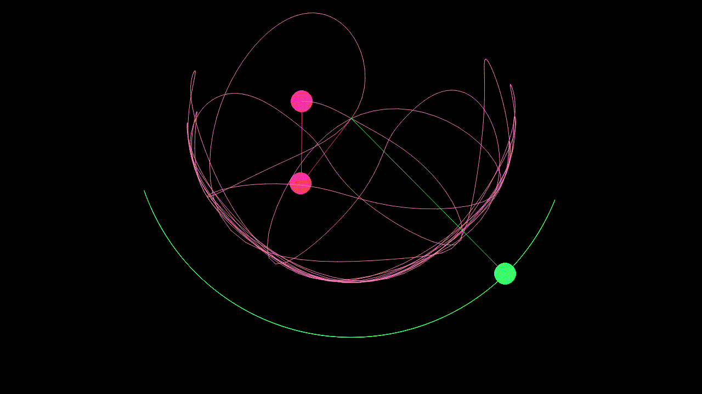

# Simulation of Double Pendulums: A demonstration of the Butterfly Effect.

The aim of this project is to demonstrate the butterfly effect through a graphical simulation of a double pendulum system. This simulation uses the pygame library for the graphical aspects and all other physics are written from scratch in python. 


### Table of Contents

- Overview
- Features
- Requirements
- Installation
- Usage
- Output
- License


### Overview

The double pendulum is a classic example of a chaotic dynamical system, where even small changes in initial conditions can lead to drastically different outcomes over time. This simulation allows you to experiment with different initial conditions and observe the resulting motion of the double pendulum.


### Features

- Real-time simulation of a double pendulum system.
- Adjustable initial conditions (initial angles and pendulum lengths).
- Visualization of the pendulum's motion using pygame.


### Requirements

- Python (>= 3.6)
- pygame (>= 2.3)


### Installation

1. Clone this repository to your local machine or download the ZIP file.
```bash
git clone https://github.com/preyasu-rakshit/Double-Pendulums.git
```

2. Navigate to the project directory.
```bash
cd double-pendulums
```

3. Install the required dependencies using pip.
```bash
pip install -r requirements.txt
```

### Usage

1. This simulation has two demos: one demonstrates the difference between a single and a double pendululm. For this demo, run:
```bash
python main_comparision.py
```

2. For the second demo which demonstrates the butterfly effect by starting 1000 double pendulums with very similar initial conditions and seeing how quickly they diverge. For this demo, run:
```bash
python main.py
```

3. To change parameters like mass, length of string, initial angle etc, change the parameters passed when creating the object from the double_pendulum / Pendulum class in main_comparison.py / main.py .


### Output

1. A sample from the first demo:


2. Sample from second demo:


### License

This project is licensed under the MIT License.